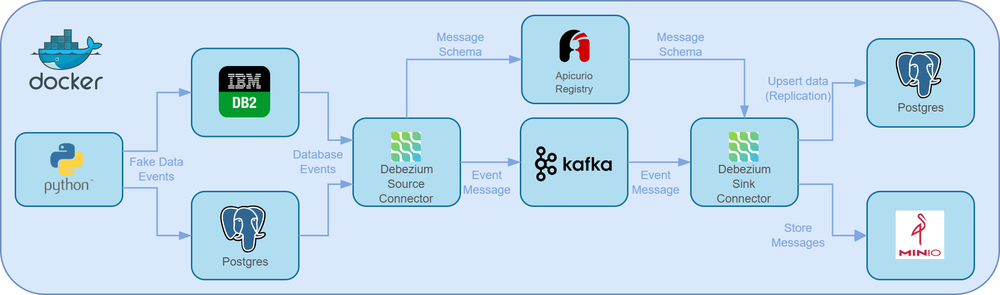
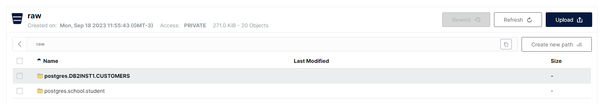
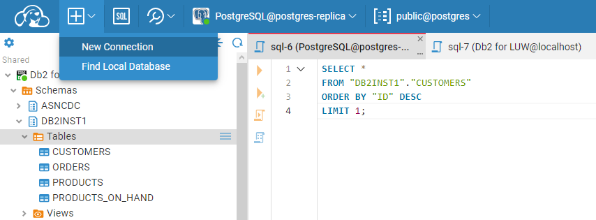
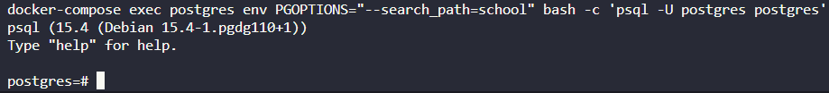
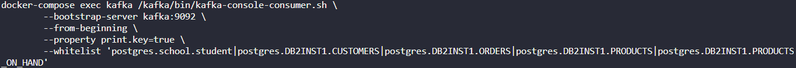

<!-- toc -->

# Change Data Capture (CDC) Example using Debezium

This is for development porpouse only. To execute on a production environment you should consider using Kubernetes and a proper credential management.

## Introduction

Change data capture is the tracking of all changes in a data source like databases, data warehouses, etc. in such a way that they can be captured in destination systems. This is done to achieve data integrity and consistency in all systems downstream.

There are many ways to do CDC operations. One is done via Debezium where the first load is done by a snapshot of a database and then all changes are streamed.

The streaming is achieved by using Kafka and Kafka Connectors. Kafka is a messaging service where you can send and queue messages to many consumers. The connectors are the interfaces of the message queues to other services. In short, Debezium implements the Kafka connectors to relational databases.

This example architecture is illustrated in the following image:



## Debezium Source Connector

The Debezium source connector is built from the debezium connector image, whuch is built from a kafka connect image.

Debezium provides the connectors and configurations for some relational databases such as Postgres and IBM DB2.

In this example the messages uses the AVRO formatting with an Apicurio Schema Registry. The AVRO format is more efficient than a simple Json and Apicurio Schema registry is reponsible for storing and versioning the message schema to avoid problems in data exchange between connectors, like saving data types, evolution of table schemas or simply changes to message format.

### DB2 Connector

DB2 connector is documented [here](https://debezium.io/documentation/reference/2.3/connectors/db2.html) and in short it streams the events of tables that are configured in capture mode. Debezium provides a DB2 Dockerfile with the right configurations for 4 different tables, which are CONSUMERS, ORDERS, PRODUCTS and PRODUCTS_IN_HAND under DB2INST1 schema. It populates the table with the SQL provided [here](containers/db2/inventory.sql).

The connector configuration file is [here](connectors/db2.json).

### Postgres Connector

Postgres connector is documented [here](https://debezium.io/documentation/reference/2.3/connectors/postgresql.html). In Postgres it uses changes commited to the transaction log. This log is called Write Ahead Log (WAL). Therefore, your postgres instance must be configured to generate this log and an user must have access to this log via a logical decoding plug-in to execute the replication. This installation is documented [here](https://debezium.io/documentation/reference/2.3/postgres-plugins.html).

The debezium schema is initialized with a postgres database configured for replication and a school schema. The initialization SQL is provided [here](containers/postgres/init.sql).

The connector configuration file is [here](connectors/postgres.json).

## Debezium Sink Connector

The sink connector is responsible for reading and translating messages to a specific service. Since the source connector is configured for AVRO formatting and Apicurio Registry, this connector also is. It uses Debezium JDBC Sink connector to replicate DB2 and Postgres data into a single postgres database and also an S3 connector to store the messages into an Object Storage called Minio. The messages stored on Minio can be used as a backup to recreate the database in case some of the services fails.

### Object Storage (Minio) Connector

The connector is configured in such a way that data is stored in a raw layer in parquet with the following template:

\<source-topic>/\<yyyy-MM-dd>/\<HH>/\<partition>-\<start_offset>.parquet



The connector configuration file is [here](connectors/sink-minio.json).

The bucket "raw" is created by an ephemeral service called "createbuckets". This only interacts with Minio to create the bucket with the provided credentials.

### JDBC Sink Connector

The JDBC connector replicates all changes made into DB2 and Postgres databases. It uses the topic template to undestand which database, schema and table is being updated. Therefore for postgres it's mandatory that the postgres replica is properly initialized with at least the database and schema matching the topic template.

Avoiding changes into debezium images, both topic prefixes for DB2 and Postgres source connectors are postgres, to match the replica database name. The schemas DB2INST1 and school are properly initialized in the SQL provided [here](containers/postgres/init-replica.sql).

The connector configuration file for the DB2 data is [here](connectors/sink-postgres-inventory.json) and for the postgres data [here](connectors/sink-postgres-school.json).

## Fake Data Generator

There is a Python script configured to generate Fake Data so you can observe the streaming process happening. This script uses psycopg2 to connect to postgres, ibm_db to connect to DB2 and Faker to generate fake data easily to the tables.

## Running the Example

The services are created by a docker compose and then the Debezium connectors must be manually configured and monitored. For convenience, a [Makefile](Makefile) was provided with several commands.

### Running Containers

To start the containers use

```make
make up
```

### Monitor

If you want an UI to monitor DB2 and Postgres source databases being feeded by datagen service, you can use the Dbeaver instance at [localhost](http://localhost:8978). 

Please configure the first access, click at the beaver at the upper left and configure database connection. You should then be able to see database informations and interact using SQL statements.



Alternatively you can acess Postgres via terminal using

```bash
make pg
```



Finally you should access kafka before configuring the connectors to see the event streaming.

```bash
make monitor
```

This will access all configured topics and messages will appear after connector configuration. Because of the AVRO formatting the messages will not be readable.



You can monitor the sink and source connectors in other terminals with:

```bash
make monitor-connector-sink

make monitor-connector-source
```

You should see debugging messages when connectores are properly initialized.

### Initializing connectors

To initialize the connectors a message must be sent to Kafka REST API. The messages containing the connector configuration Jsons are already configured with the following command:

```bash
make init-connectors
```

At this moment you should see the streaming happening at the kafka monitor terminal and in moments you should see changes replicated to the postgres-replica instance using Dbeaver or terminal access. You can manually add, update or delete data in DB2 or Postgres via SQL statements and also see the changes happening.

If you need to restart the datagen service, you can use

```bash
make restart-datagen
```

Any connector problems are going to be reported in the connector logs. More information is also provided in Kafka REST API. You can debug using

```bash
make list-connectors
```

To restart connectors after some error, you can delete and init again using

```bash
make delete-connectors
make init-connectors
```

Or simply trying to restart the connectors

```bash
make restart-connectors
```

There are many commands inside Makefile. You should check that out.

If any problem occurs, please read the debezium and kafka documentations for help.
